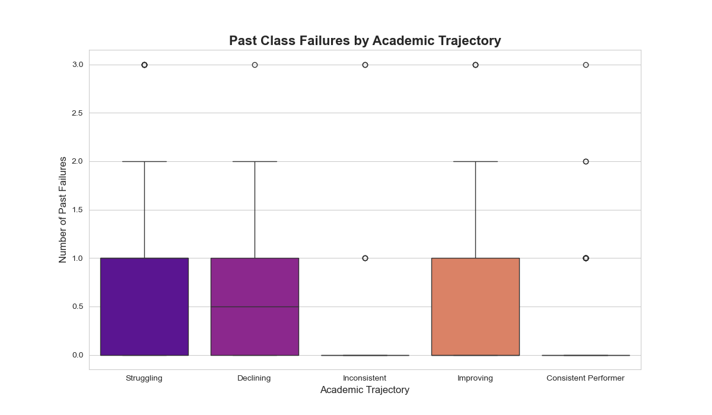
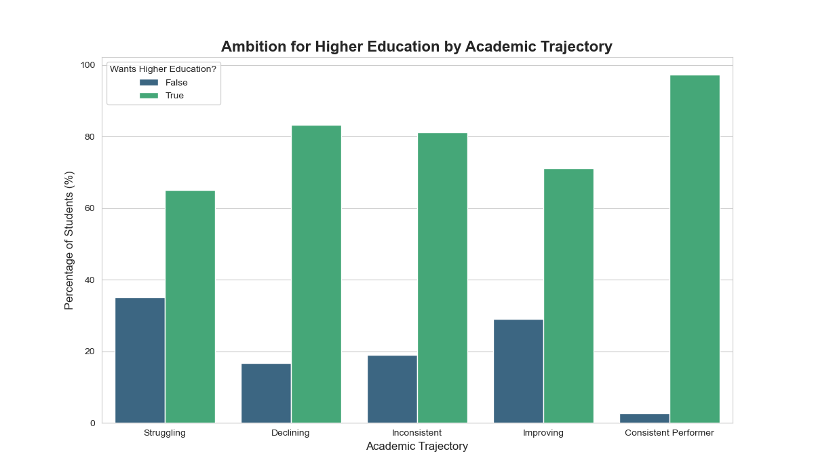
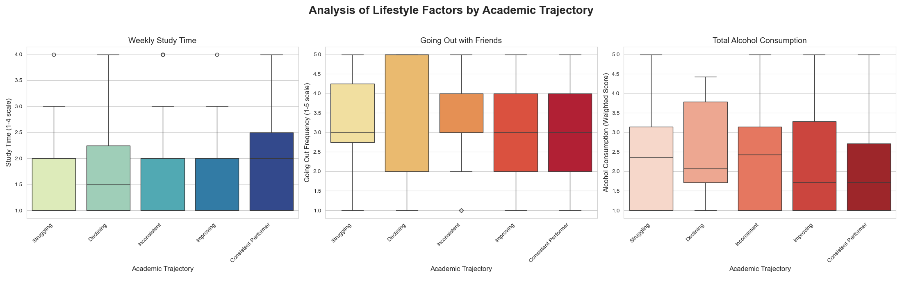

# Student Performance Analysis & Success Prediction

---

### 1. Project Overview

This project is an in-depth exploratory data analysis (EDA) of a student performance dataset. The primary goal is to identify key factors that influence academic success and to provide actionable, data-driven recommendations to a school administration. The entire workflow, from data cleaning and feature engineering to final reporting, is documented to showcase a complete, industry-standard data analysis process.

This project was undertaken as a practical exercise to apply and demonstrate core data analysis skills in a real-world context.

---

### 2. Business Problem

A school administration is facing a wide disparity in student academic outcomes. They need to understand the root causes behind this variation to move from a reactive to a proactive support model. This analysis aims to answer the question: **"What are the most significant predictors of student success, and how can we use that information to improve it?"**

---

### 3. Data Source

The dataset used is the "Student Performance Data Set" from the UCI Machine Learning Repository. It contains demographic, social, and school-related data for 649 students in two Portuguese secondary schools.

---

### 4. Methodology & Workflow

The project followed a structured data analysis workflow:

* **Data Cleaning & Preprocessing:** Handled inconsistencies, checked for duplicates, and converted data types for efficient analysis.
* **Feature Engineering:** Created a new, insightful `academic_trajectory` feature (`Consistent Performer`, `Improving`, `Declining`, `Struggling`) by combining grades from all three academic periods (G1, G2, G3). This provides a more nuanced view than a simple pass/fail status.
* **Exploratory Data Analysis (EDA):** Used data visualization to explore relationships between various factors and student academic trajectories.
* **Reporting:** Summarized key findings and translated them into actionable recommendations for the target audience (school administration).

---

### 5. Key Findings & Visualizations

The analysis uncovered several powerful predictors of student performance.

#### Finding 1: Past Failures are the Strongest Red Flag
There is a stark contrast in the number of past class failures between high-achieving and at-risk students. 'Consistent Performers' have virtually zero past failures, making this the most critical indicator for early intervention.



#### Finding 2: Ambition for Higher Education Drives Success
A student's desire to pursue higher education is strongly correlated with their academic trajectory. This highlights the importance of motivation and long-term goals.



#### Finding 3: Lifestyle Choices Have a Clear Impact
Factors outside the classroom, such as alcohol consumption and social habits, are significantly correlated with academic outcomes. Notably, higher alcohol consumption is consistently linked to poorer performance.



---

### 6. Actionable Recommendations

Based on the data, the following strategies are recommended:

1.  **Implement an "Early Warning" Intervention Program:** Proactively identify and provide mandatory academic support to any student with one or more past class failures.
2.  **Launch a "Future Forward" Mentorship Program:** Increase student motivation by connecting them with mentors and showcasing the benefits of higher education to foster ambition.
3.  **Introduce a Holistic Student Wellness Initiative:** Run workshops on the academic impact of lifestyle choices and offer resources to help students and families build a supportive home environment.

---

### 7. Technical Stack

* **Language:** Python
* **Libraries:**
    * `pandas` for data manipulation and cleaning
    * `matplotlib` & `seaborn` for data visualization
    * `Jupyter Notebook` for analysis and documentation

---

### 8. How to Run This Project

To replicate this analysis, please follow these steps:

1.  **Clone the repository:**
    ```bash
    git clone [https://github.com/your-username/student-performance-analysis.git](https://github.com/your-username/student-performance-analysis.git)
    ```
2.  **Navigate to the project directory:**
    ```bash
    cd student-performance-analysis
    ```
3.  **Install the required libraries:**
    ```bash
    pip install -r requirements.txt
    ```
4.  **Step 1 - Data Cleaning:** Run the first notebook to clean the raw data. This will generate a `cleaned_student_data.csv` file.
    ```bash
    jupyter notebook notebooks/01_data_cleaning_and_preprocessing.ipynb
    ```
5.  **Step 2 - Exploratory Analysis:** Run the second notebook to perform the analysis and generate all visualizations.
    ```bash
    jupyter notebook notebooks/02_exploratory_data_analysis.ipynb
    
