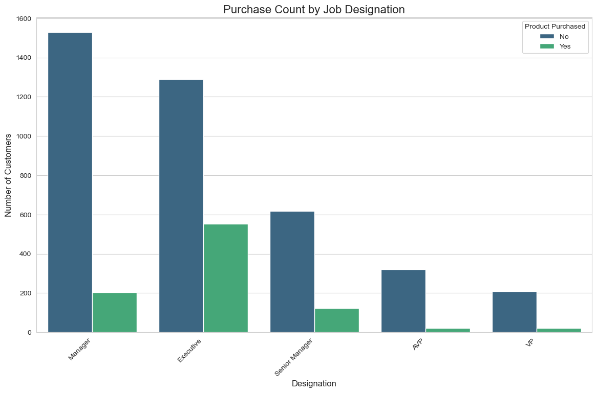
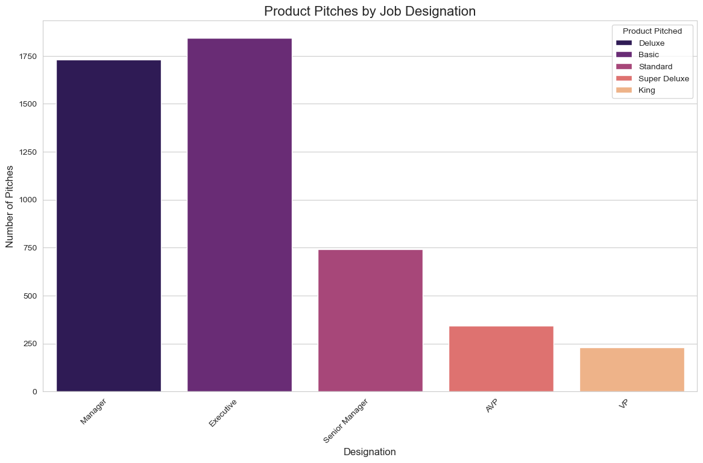
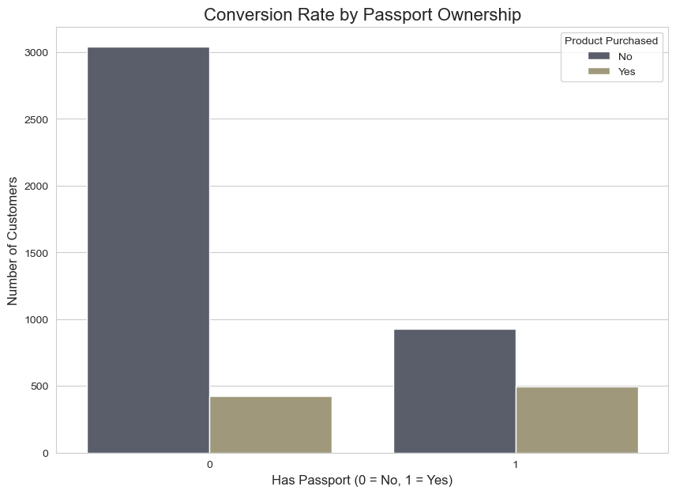

# Analysis of Sales Conversion for a Travel Company

## 1. Introduction: The Business Problem

This project simulates a real-world data analysis task. I acted as a Data Analyst for a fictional travel company, tasked by the CEO to investigate a low sales conversion rate of approximately 19%. The goal was to move beyond surface-level metrics and perform a deep-dive Exploratory Data Analysis (EDA) to identify the key factors driving sales and provide actionable recommendations for improvement.

The full project brief can be found in the `reports` folder: [**1_PROJECT_BRIEF_FROM_CEO.md**](./reports/1_PROJECT_BRIEF_FROM_CEO.md)

---

## 2. Key Findings & Recommendations

Our analysis successfully identified a "Golden Customer" profile, evaluated sales strategies, and uncovered significant market opportunities. The full analysis and recommendations are detailed in the final report to the CEO.

**View the full report here:** [**2_FINAL_REPORT_TO_CEO.md**](./reports/2_FINAL_REPORT_TO_CEO.md)

### Summary of Recommendations:
1.  **Overhaul the Premium Product Strategy:** Address the failure of 'Deluxe' and 'King' packages with high-income clients by conducting market research and A/B testing new value propositions.
2.  **Empower the Sales Team & Prioritize High-Intent Leads:** Implement a lead scoring system where "Company Invited" leads with a passport are flagged as "Hot Leads" and fast-tracked.
3.  **Launch a Targeted "Executive Upgrade" Campaign:** Create a dedicated marketing campaign to upsell our most successful customer segment (Executives) from the 'Basic' to the 'Deluxe' package.

---

## 3. Key Visualizations

The following charts represent the most critical insights from the analysis.

### Insight 1: Conversion Rate is Heavily Dependent on Job Title
Our analysis revealed that **Executives** are our "Golden Customers," converting at an incredible **30% rate**. However, our conversion rate plummets for senior roles, indicating a failure to sell our premium products.

### Insight 2: The Cause - A Rigid and Mismatched Product Strategy
The reason for the conversion failure with senior clients is our inflexible sales strategy. We only pitch 'Basic' to Executives (a success) but only pitch 'Deluxe' to Managers (a failure). This chart proves the root cause of the problem.

### Insight 3: The Opportunity - Passport Ownership Signals High Intent
A customer holding a passport is nearly **three times more likely to buy** (35% conversion vs. 12%). This provides a simple, powerful qualifying factor for our sales team.

---

## 4. Project Workflow

The project followed a structured data analysis workflow:
1.  **Data Cleaning & Validation:** Handled missing values (using median and grouped median imputation), corrected data types, and standardized categorical values across all 20 columns.
2.  **Exploratory Data Analysis (EDA):** Performed univariate and bivariate analysis to answer the key business questions outlined in the project brief.
3.  **Reporting & Recommendations:** Synthesized all findings into a final, actionable report for senior leadership.

---

## 5. Technical Details

* **Language:** Python
* **Libraries:** Pandas (for data manipulation), Matplotlib & Seaborn (for visualization)
* **Environment:** Jupyter Notebook

The full analysis code can be found in the notebook: [`/notebooks/EDA_Travel_Analysis.ipynb`](./notebooks/EDA_Travel_Analysis.ipynb)
